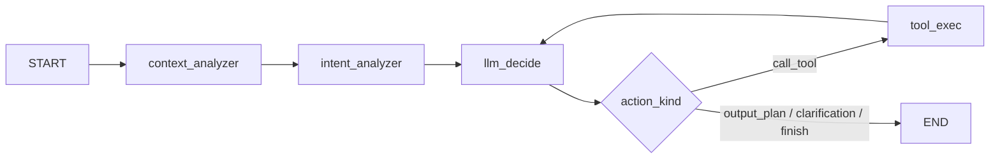
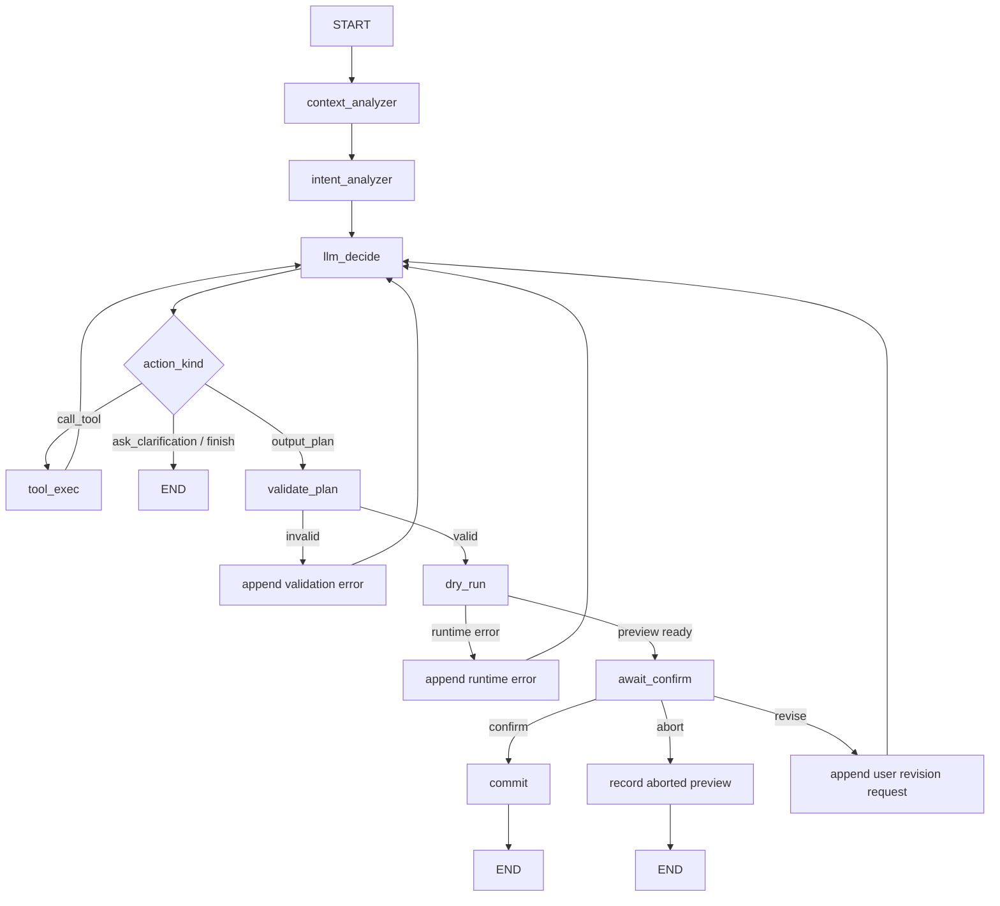

## Execution Checklist

Keep this list aligned with the YAML `todos`; the YAML status is the source of truth.

- [ ] Define preview/confirmation state and `PreviewRecord` (`define-preview-state`)
- [ ] Split plan execution into dry-run and commit paths (`split-dry-run-commit`)
- [ ] Extend the LangGraph flow with validation, preview, confirmation, abort, and revise branches (`extend-langgraph-flow`)
- [ ] Wire frontend controls to confirm, abort, and revise decisions (`wire-ui-confirmation`)
- [ ] Add regression tests and docs updates (`regression-and-docs`)

# Agent Preview Abort Loop

## Background

The current LangGraph orchestration covers the front half of the workflow:



This is enough for context collection, tool-assisted planning, and structured `Plan` output. The later lifecycle is still mostly frontend-owned: diff preview, user confirmation, apply, undo, and aborted previews.

## Target Semantics

`abort` means Cursor-style **Undo all during preview**:

- The generated plan and preview record are retained in conversation/history.
- No table data is committed.
- No rollback is needed because the preview path must not mutate committed data.
- The user can continue from the retained record by asking for a revision.

This differs from `revert`, which is a post-commit inverse operation over already applied changes.

## Target Flow



## State Contract

Add a lightweight preview history rather than storing large table snapshots in the agent state.

```python
class PreviewRecord(BaseModel):
    plan: Plan
    diff_summary: str
    outcome: Literal["pending", "aborted", "committed", "reverted"]
    user_decision_reason: str | None = None
    created_at: float


class AgentState(BaseModel):
    preview_history: list[PreviewRecord] = []
    revision_count: int = 0
    last_execution_error: str | None = None
```

Implementation notes:

- Keep full row/table data out of `AgentState` unless the project later introduces a durable backend `ProjectState`.
- Store compact diff metadata for history display and LLM feedback.
- Cap `revision_count` to prevent infinite regenerate loops.

## API And UI Shape

The first implementation should preserve existing `/api/agent` and `/api/agent-stream` compatibility where possible.

- Add a terminal action such as `await_confirmation` for preview-ready plans.
- Stream preview-ready state to the UI with the generated plan and diff summary.
- Let the UI submit one of three decisions: `confirm`, `abort`, or `revise`.
- Treat `abort` as a recorded normal outcome, not as an error.
- Keep current post-commit undo behavior for already applied changes.

## Non-Goals

- Do not introduce a separate agent runtime or message schema.
- Do not persist full workbook snapshots in the agent state.
- Do not replace the existing frontend undo stack in this slice.
- Do not expand spreadsheet operation types unless required by tests.

## Verification

- Unit test that dry-run does not mutate committed table data.
- Unit test that abort records `outcome="aborted"` and leaves committed data unchanged.
- Unit test that confirm commits the same diff produced by dry-run.
- Unit test that validation/runtime failures append feedback and return to the LLM with a revision cap.
- UI smoke test: generate plan → preview → abort → history retains the preview record → table data is unchanged.
