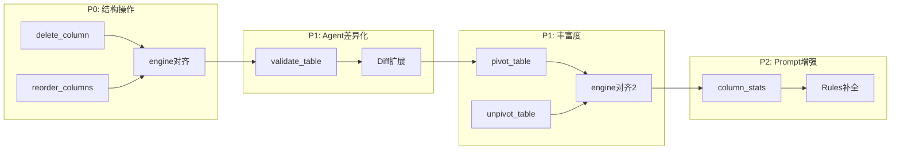

## 执行清单（Todos）

与上方 YAML `todos` 同步；完成后请同时勾选本节与 YAML `status`。

- [x] P0：新增 `delete_column` Step — 后端 model + executor，前端 types + engine (`p0-delete-column`)
- [x] P0：新增 `reorder_columns` Step — 同上 (`p0-reorder-columns`)
- [ ] P1：新增 `validate_table` Step + Diff 扩展（`validationWarnings` / `validationErrors`）(`p1-validate-table`)
- [ ] P1：新增 `pivot_table` Step — 后端 + 前端对齐 (`p1-pivot-table`)
- [ ] P1：新增 `unpivot_table` Step — 后端 + 前端对齐 (`p1-unpivot-table`)
- [ ] P2：`prompt_content.py` 补全 Rules + 可选 `build_column_stats` 注入 user 消息 (`p2-prompt-enhance`)

# Agent Step 增强：P0/P1 落地 + Prompt 上下文增强

## 当前状态（与仓库同步）

| 项 | 状态 | 说明 |
|----|------|------|
| **Step 数量** | 16 种 | 在原有 14 种基础上已合并 `delete_column`、`reorder_columns`（`server/app/models/plan.py` 的 `Step` Union）。 |
| **P0** | 已完成 | 后端 `plan_executor`、前端 `types.ts` / `engine.ts` / `llm.ts` zod 均已对齐。 |
| **P1** | 未开始 | 无 `validate_table` / `pivot_table` / `unpivot_table` 模型与执行路径；`Diff` 无 `validationWarnings` / `validationErrors`。 |
| **P2 Rules** | 未扩充 | `prompt_content.py` 中 `_SPREADSHEET_RULES` / `_PROJECT_RULES` 仍偏短，未覆盖新 Step 与其它已有 Step 的自然语言说明。 |
| **列统计** | 部分满足 | 原文案是 **user 消息里自动注入** `build_column_stats`；当前仓库在 **Agent 工具** 中提供 [`get_column_stats`](server/app/services/tools.py)（基于样本行：count、distinct、min/max 等），与「单次 `/api/plan` 无 tools」场景的自动注入**不是同一件事**。 |

## 现状

需改动的 4 个核心文件（P1 仍适用）：

- 后端模型层：[server/app/models/plan.py](server/app/models/plan.py)
- 后端执行器：[server/app/services/plan_executor.py](server/app/services/plan_executor.py)
- 前端类型：[client/src/types.ts](client/src/types.ts)
- 前端引擎：[client/src/engine.ts](client/src/engine.ts)

Prompt 层：[server/app/services/prompt_content.py](server/app/services/prompt_content.py)

## 一、P0 新增 Step（高频刚需，结构简单）

### 1.1 `delete_column` -- 删除列

用户常说"去掉 XXX 列"，目前无法覆盖。

```python
class DeleteColumnStep(BaseModel):
    action: Literal["delete_column"]
    column: str
    table: Optional[str] = None
    note: Optional[str] = None
```

前后端执行逻辑：

- 遍历 rows，`delete row[column]`
- 从 schema 中移除该列
- `diff.modifiedColumns.push(column)` （标记为"被修改"，前端 UI 可高亮）

**落地状态：已实现。**

### 1.2 `reorder_columns` -- 列重排

用户说"把 name 列挪到第一列"或"按 id, name, age 排列"。

```python
class ReorderColumnsStep(BaseModel):
    action: Literal["reorder_columns"]
    columns: List[str]     # 新的列顺序（可只包含部分列，未提及的列追加到末尾）
    table: Optional[str] = None
    note: Optional[str] = None
```

前后端执行逻辑：

- 计算完整列顺序：`specified + (original - specified)`
- 重建每行 dict 保持新 key 顺序
- 更新 schema 顺序

**落地状态：已实现。**

## 二、P1 新增 Step（Agent 差异化 + 丰富度）

以下三节仍为**设计说明**，**尚未在代码中实现**。

### 2.1 `validate_table` -- 轻量校验（Agent 自检）

这是和普通 "chat wrapper" 拉开差距的关键 Step。执行时**不修改数据**，只检查约束是否满足，失败时在 diff 中标记 warning。

```python
class ValidateTableStep(BaseModel):
    action: Literal["validate_table"]
    table: Optional[str] = None
    rules: List[str]       # 每条 rule 是行级表达式，如 "row.price > 0"
    level: Literal["warn", "error"] = "warn"
    note: Optional[str] = None
```

前后端执行逻辑：

- 逐 rule 对所有行求值（复用 `_eval_row_expression` / `safeEval`）
- 若 level="error" 且有行不通过，在结果中标记 `validationErrors`
- 若 level="warn"，在结果中标记 `validationWarnings`
- **不修改 rows/schema**

需要扩展 Diff 类型以携带校验结果：

```typescript
export type Diff = {
  addedColumns: string[];
  modifiedColumns: string[];
  validationWarnings?: string[];   // 新增
  validationErrors?: string[];     // 新增
};
```

后端 `ApplyResult` / `ProjectApplyResult` 的 `diff` dict 也相应扩展。

### 2.2 `pivot_table` -- 透视表

```python
class PivotTableStep(BaseModel):
    action: Literal["pivot_table"]
    source: str
    index: List[str]       # 行维度
    columns: str           # 列维度（该列的唯一值展开成列）
    values: str            # 聚合的值列
    agg: Literal["sum", "count", "avg", "max", "min"] = "sum"
    resultTable: str
    note: Optional[str] = None
```

执行逻辑：

- 按 `index` 分组
- 每组按 `columns` 字段的唯一值展开成列
- 生成新列名格式：`{values}_{columnValue}`
- 对每个 cell 按 `agg` 聚合
- 输出到 `resultTable`

### 2.3 `unpivot_table` -- 反透视（宽转长）

```python
class UnpivotTableStep(BaseModel):
    action: Literal["unpivot_table"]
    source: str
    idVars: List[str]       # 保留列
    valueVars: List[str]    # 被"融化"的列
    varName: str = "variable"
    valueName: str = "value"
    resultTable: str
    note: Optional[str] = None
```

执行逻辑：

- 对每行，保留 `idVars` 的值
- 把 `valueVars` 中的每列拆成一行（varName=列名, valueName=值）
- 输出到 `resultTable`

## 三、Prompt 上下文增强（P2，非 Step）

当前 system prompt 只注入了 JSON Schema，而 user message 中只有 `schema + sampleRows`。LLM 缺乏对数据全貌的了解（空值率、唯一值数、数值范围），容易"幻觉"。

**原做法**：在 [server/app/services/prompt_content.py](server/app/services/prompt_content.py) 中新增 `build_column_stats(rows, schema)` 函数，将统计结果格式化为文本，追加到 user message 的表上下文中。

**当前差异**：

- Agent 多轮路径已可通过工具 [`get_column_stats`](server/app/services/tools.py) 拉取列级统计（基于样本，非全表），不必等 P2 完成也能部分探查数据。
- 若要对齐原文案，仍需：在 `prompt_content`（或 plan 请求组装处）实现 **全量/大样本** 统计注入，并补全 Rules；与工具是**互补**关系。

需改动 `_PROJECT_RULES` / `_SPREADSHEET_RULES`，并在需要时在构建 user message 时注入统计摘要。

## 四、Prompt Rules 同步

当前 `_SPREADSHEET_RULES` 和 `_PROJECT_RULES` 只覆盖了少量 Step 的用法。P0 已增加 `delete_column` / `reorder_columns` 后，**仍建议**补充规则条目与 Schema 一致，让 LLM 在「无 tools」的 plan 请求中也能稳定选用。

需追加规则条目覆盖：

- `delete_column`、`reorder_columns` 的使用场景
- `validate_table` 的 rules 表达式格式（待 P1）
- `pivot_table` / `unpivot_table` 的参数语义（待 P1）
- `filter_rows`、`delete_rows`、`deduplicate_rows` 等已有但未在 rules 中充分描述的 Step

## 五、文件改动清单

P0 已勾选部分可视为完成；P1/P2 待办时仍使用同一清单：

```
server/app/models/plan.py        -- P1: 新增 3 个 Step Model，更新 Step Union
server/app/services/plan_executor.py -- P1: 新增 3 个 Step 的执行逻辑 + diff 扩展
client/src/types.ts              -- P1: 新增 3 个 PlanStep 分支 + Diff 扩展
client/src/engine.ts             -- P1: 新增 3 个 Step 的执行逻辑（applyPlan + applyProjectPlan）
server/app/services/prompt_content.py -- P2: 补全 Rules + 可选 build_column_stats / user 注入
```

## 六、实施顺序（按依赖）



**进度备注**：`p0` 子图已完成；`p1a` / `p1b` / `p2` 未开始。工具 `get_column_stats` 可视为 P2 能力的一条「旁路」实现，不替代 `prompt_content` 中的规则与注入工作。

---

每一步都是：后端 model -> 后端 executor -> 前端 types -> 前端 engine -> 验证对齐，保证不出现前后端不一致。
