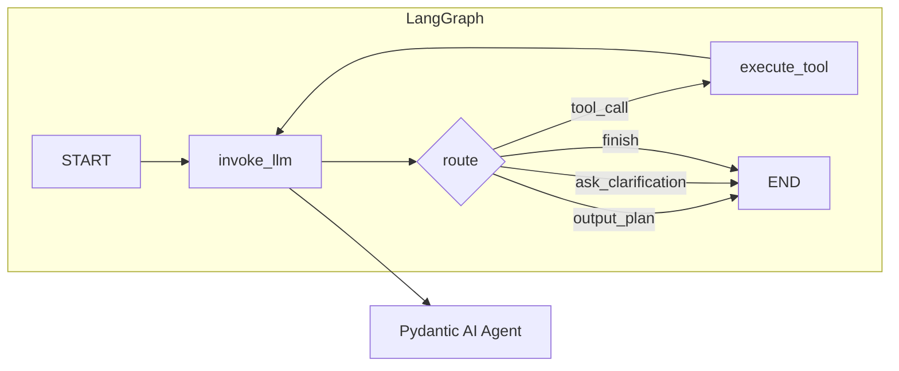

# LangGraph + Pydantic AI migration (merged)

**Supersedes:** `langgraph+pydantic_ai_迁移_0c573c3e.plan.md`, `langgraph_+_pydantic_ai_迁移_8ebc8333.plan.md` (duplicate drafts of the same architecture).

## Goals

- **LangGraph**: graph state, nodes (LLM, tool execution, clarification routing), conditional edges, streaming aligned with `/api/agent-stream`.
- **Pydantic AI**: tool registration, structured output / `result_type` for `Plan`, retries where the framework helps.
- **Keep**: Pydantic models in `server/app/models/` for HTTP and `Plan`; OpenRouter/Ollama configuration from `config.py`.

## Current architecture (before)

- **Agent**: `decision()` + `run_agent_loop()` in `server/app/agent/decision.py`, `AgentState` in `state.py`, actions in `actions.py`.
- **LLM**: `server/app/services/llm.py` — `call_llm` / `call_llm_with_tools`.
- **Tools**: `server/app/services/tools.py` — JSON schema + `run_tool`.
- **Plan**: `Plan.model_validate` after JSON extraction.
- **API**: `/api/plan`, `/api/plan-project`; `/api/agent`, `/api/agent-stream` must stay compatible.

## Target architecture

| Layer | Before | After |
| ----- | ------ | ----- |
| Orchestration | `run_agent_loop` + `decision()` | LangGraph `StateGraph`: decision node ↔ tool node with conditional edges |
| LLM + validation | Manual JSON + `Plan.model_validate` | Pydantic AI agent with tools + structured `Plan` (or hybrid: PA single step, LG loops) |
| State | dataclass `AgentState` | `TypedDict` or Pydantic state for LangGraph reducers (e.g. `messages`) |
| API models | Pydantic | **Unchanged** (`plan.py`, `chat.py`, request/response types) |

## Dependencies and layout

- **Deps** (e.g. `pyproject.toml`): `langgraph`, `pydantic-ai`; keep `pydantic`, `httpx`.
- **Suggested modules**:
  - `server/app/graph/` — compiled graph, state schema, streaming entry (alternative: `server/app/agent/graph.py`).
  - `server/app/agent/` — thin Pydantic AI agent factory used by graph nodes.
  - `server/app/services/` — keep `tools.py` implementations; register tools with Pydantic AI.

## Graph design

- **State** (map from `AgentState`): `tables`, `messages`, `applied_plans_summary`, `current_turn`, `max_turns`, `user_prompt`, model ids, plus `last_action` / `pending_tool_call` for routing.
- **Nodes**:
  1. **invoke_llm** — run Pydantic AI (tools + optional `result_type=Plan`); set `last_action` and tool payload.
  2. **execute_tool** — `run_tool`, append assistant/tool messages, increment turn, clear pending call.
- **Edges**: `START → invoke_llm`; conditional on `last_action` to `execute_tool` or `END`.
- **Streaming**: `astream_events` / `stream` mapped to existing SSE: `tool_call`, `tool_result`, `plan_done`, `clarification`, `finish`.

## Pydantic AI integration

- **Approach A (recommended for SSE parity)**: each PA call is one “step”; tool calls return to LangGraph’s `execute_tool`, then back to `invoke_llm` — matches today’s per-step events.
- **Approach B**: PA runs an inner multi-tool loop; LangGraph only wraps “run agent once”; streaming depends on PA’s APIs.
- Register tools from `tools.py` with Pydantic parameter models; inject `tables` from graph state.
- Provide OpenRouter/Ollama via OpenAI-compatible model config or custom transport.

## API routes

- **`/api/agent`**: build initial state → `graph.ainvoke` / `invoke` → map final state to `PlanResponse` / clarification / errors (same shapes as today).
- **`/api/agent-stream`**: stream graph events → existing `_sse` format.
- **`/api/plan`, `/api/plan-project`** (optional later): single-shot PA run with `result_type=Plan` for shared validation.

## Implementation order

1. Add deps; PA model wrapper for OpenRouter/Ollama.
2. Define graph state + `invoke_llm` / `execute_tool` + compile; non-stream parity with `run_agent_loop`.
3. Migrate tools to PA registration; inject state.
4. Wire `/api/agent-stream` streaming.
5. Optionally unify single-turn plan routes on PA.
6. Remove or narrow legacy `run_agent_loop` / `decision` once regression passes.

## File change checklist (indicative)

| File | Change |
| ---- | ------ |
| `server/pyproject.toml` | add `langgraph`, `pydantic-ai` |
| `server/app/agent/state.py` | LangGraph state + `initial_state_*` adapters |
| New `server/app/agent/graph.py` or `server/app/graph/` | `StateGraph`, nodes, `build_agent_graph()` |
| New `server/app/services/llm_pydantic_ai.py` (optional) | PA calls used by decision node |
| `server/app/agent/decision.py` | deprecate loop; or thin wrapper over graph |
| `server/app/api/routes/agent.py` | invoke / astream graph |
| `FEATURES.md` / `AGENT_IMPROVEMENTS.md` | document architecture |

## Risks

- PA + custom Ollama/OpenRouter endpoints may need extra adapter work; fallback is LG nodes still calling `llm.py` with PA only for schemas/tools.
- SSE ordering must match node boundaries; add explicit mapping tests.
- Preserve `messages` / history semantics for `initial_state_from_agent_project_request`.
