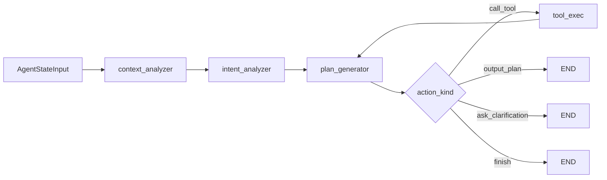

## 执行清单（Todos）

与上方 YAML `todos` 同步；完成后请同时勾选本节与 YAML `status`。

- [ ] 统一 `AgentState` / `AgentAction` 导入与单一命名空间（`app.agent` 等）(`unify-imports-state`)
- [ ] 搭建 LangGraph 编排：ReAct 主循环 + 可选 context/intent 前置节点 (`build-langgraph-orchestrator`)
- [ ] 子代理 MVP：`plan_generator` 承载现有 decision；context/intent 透传或轻量增强 (`implement-subagents-mvp`)
- [ ] `/api/agent` 与 `/api/agent-stream` 切换到新编排器，响应/SSE 形状不变 (`switch-agent-routes`)
- [ ] 回归（plan、tools、澄清、SSE）并更新 `FEATURES.md` / `AGENT_IMPROVEMENTS.md` (`regression-and-docs`)

# LangGraph three-subagent migration (merged)

**Supersedes:** `langgraph_agent_平移方案_b97aa0b1.plan.md`, `langgraph三子代理迁移_e37ae97f.plan.md` (same initiative, two drafts).

## Goals and scope

- **Goal**: Orchestrate `context_analyzer` → `intent_analyzer` → `plan_generator` with an explicit **tool loop** (`call_tool` → `run_tool` → back to LLM), matching today’s multi-turn, clarification, and SSE behavior.
- **Constraint**: No breaking changes to `/api/agent` or `/api/agent-stream` payloads/event names.
- **Non-goal (first slice)**: New capabilities — **parity only**; deeper “smart” context/intent LLM stages come later.

## Current issues to fix first

- Mixed **`app.agent` / `app.agents`** imports and duplicate/overlapping state types.
- `sub_agents` files exist but are not wired into the main decision/tool loop.
- Stable logic still lives in `decision.py` and routes while paths drift.

## Target flow (MVP parity)

- **context_analyzer / intent_analyzer (MVP)**: pass-through or light normalization — avoid extra LLM calls until parity is proven.
- **plan_generator**: host existing `decision` behavior — JSON parse, `Plan.model_validate`, `_maybe_need_clarification`, `AgentAction`; `use_tools=True` for the main ReAct loop.
- **tool_exec**: `services/tools.run_tool`, append `assistant` + `tool` messages, respect `max_turns`.

## Implementation steps

1. **Normalize module boundary** — one canonical package for agent code; fix imports in `api/routes/agent.py`, `services/tools.py`, `agent/decision.py`, `agent/__init__.py` (paths in this repo: `server/app/agent/...`).
2. **Orchestrator module** — e.g. `orchestrator.py` / `workflow.py`: LangGraph with optional pre-nodes + main ReAct subgraph.
3. **Sub-agents** — MVP wiring as above; **later**: richer schema/sample summaries (context), normalized intent labels (intent), error code taxonomy (`llm_error`, `invalid_json`, `plan_validation_failed`, `max_turns`).
4. **Routes** — swap internals to orchestrator; verify sync + SSE event order.
5. **Regression** — single-shot plan, tool calling, multi-table clarification, SSE; confirm `Plan` step types in `server/app/models/plan.py`.

## Risks

- Wide import refactors: use re-exports and incremental cuts.
- Behavior drift: keep old `decision` semantics inside `plan_generator` first.
- SSE: internal state may grow; external event schema must not change.

## Relationship to “LangGraph + Pydantic AI” plan

- This document is **three-node + ReAct** on the **current** LLM/tool stack.
- `langgraph-pydantic-ai-migration.plan.md` is a **further** step: Pydantic AI for calls/validation. Can follow after parity or be combined in one graph incrementally.
