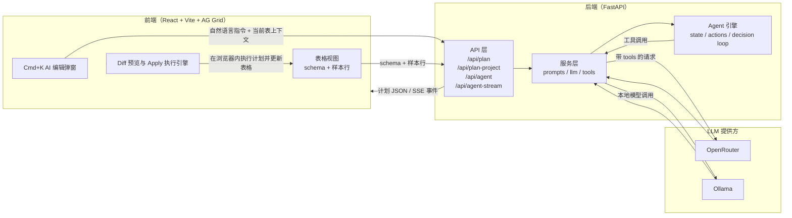

# Cursor for Spreadsheet — MVP

基于 **Cmd+K 式工作流** 的表格编辑 Demo：带上下文的自然语言 → LLM 生成**结构化执行计划** → **Diff 预览** → 一键 **Apply** 写回表格。

## 项目概述

- **项目名称**：Cursor for Spreadsheet
- **项目描述**：面向表格数据的 AI 增强编辑 Demo，支持通过自然语言生成结构化编辑计划，对多表进行清洗、转换、派生列等操作，并在浏览器端预览并应用变更。
- **技术栈**：
  - 前端：React 18、TypeScript、Vite、AG Grid
  - 后端：Python 3.10+、FastAPI、Uvicorn、httpx、openpyxl
  - LLM / 集成：OpenRouter 或本地 Ollama，通过 HTTP API 进行调用
- **整体架构**：
  - 前端负责表格展示、上下文（schema + 样本行）采集、计划请求发起、Diff 预览与在浏览器内执行计划。
  - 后端提供 `/api/plan`、`/api/plan-project`、`/api/agent`、`/api/agent-stream` 等接口，封装 LLM 调用、提示词与 Agent 流程。
 - Agent 通过多轮 LLM + 工具（读取表结构、样本、列统计与表达式校验等）生成计划，并可在存在歧义时先返回澄清问题。

### 架构图（Mermaid）



## 功能概览

### 已实现（MVP）
1. **Cmd+K「AI 编辑」弹窗**：在任意表格中按下 `Cmd+K`，打开右侧 AI 面板，输入自然语言指令，自动携带当前表结构与若干样本行作为上下文。
2. **单表计划**（`/api/plan`）：LLM 生成结构化 JSON 计划，前后端共享同一套步骤语义，包括但不限于：
   - 列级操作：`add_column`（新增派生列，支持 `row => row.price * row.quantity` 形式表达式）、`transform_column`（trim / lower / upper / replace / parse_date）、`rename_column`、`delete_column`、`reorder_columns`、`cast_column_type` 等。
   - 行级操作：`filter_rows`、`delete_rows`、`deduplicate_rows`、`sort_table`、`fill_missing`（按常数 / 均值 / 中位数 / 众数填充缺失值）等。
3. **多表 / 项目计划**（`/api/plan-project`）：在单表能力基础上，支持典型的多表场景：
   - `join_tables`：按主键/外键进行 inner / left / right join，产出新表。
   - `create_table` / `aggregate_table`：基于现有表创建派生表或聚合表。
   - `union_tables`：将多张结构相近的表纵向合并（严格 / 宽松模式）。
   - `lookup_column`：从维表中按键查找补充列。
4. **Diff 预览（表格高亮 + JSON 视图）**：
   - 在主表格中，新增列使用浅绿色列头和单元格高亮，修改过的列使用浅黄色高亮，便于一眼看出「这次计划会改动哪些列」。
   - 在右侧 AI 面板的 **Diff Preview** 区域，以 JSON 形式列出 `addedColumns` / `modifiedColumns`，默认只展示前若干行，可点击「展开全部 Diff / 收起 Diff」按钮切换完整视图。
   - 若计划会创建新表，还会在 Diff 附近显示「将新建表: ...」的提示。
5. **一键 Apply + 撤销**：
   - 生成计划后，可以先在浏览器内预览 Diff，再点击 `Apply` 由后端 `/api/execute-plan` 或项目级 `/api/projects/{id}/execute-plan` 执行完整步骤并写回表格。
   - 每次 Apply 前都会在前端记录快照，工具栏中的「撤销」按钮会将项目恢复到最近一次 Apply 之前的表格状态。
6. **AI 对话与历史**：
   - 右侧 AI 面板分为 **Chat** 与 **历史记录** 两个标签页：Chat 以对话气泡形式展示自然语言交互，历史记录则保留面向开发者的 payload / plan / diff JSON 视图。
   - Chat 中同时展示从后端 `/api/chat-history` 拉取的历史消息与本次会话即时追加的消息：用户在右侧深色气泡，AI 在左侧浅灰色气泡，系统提示为黄色卡片，并标注时间与「历史」角标。
7. **Agent 模式（实验性）**：
   - 后端提供 `/api/agent`：基于同一份多表上下文，使用多轮 LLM + 工具（schema / 样本 / 列统计 / 表达式校验等）生成计划，并在遇到歧义时返回「澄清问题」而不是直接执行。
   - 提供 `/api/agent-stream`（SSE）：以流式事件（`tool_call` / `tool_result` / `plan_done` / `finish` / `clarification`）推送 Agent 执行过程，便于前端实时展示「模型在做什么」。

### 刻意不做（当前范围）
- 协同编辑
- 完整公式引擎 / Excel 兼容
- 多表血缘图
- 外部数据源连接

---

## 环境要求

- **Python 3.10+**（后端）
- **Node.js 18+**（前端构建）

---

## 快速开始

下面是一套可以**从零环境直接照着做**的启动步骤，涵盖云端 OpenRouter 与本地 Ollama 两种模型来源。

### 步骤 0：克隆项目并准备基础环境

1. 确认本机已安装：
   - **Python 3.10+**：在终端执行 `python3 --version` 检查（`uv` 也可按需下载并管理解释器）。
   - **[uv](https://docs.astral.sh/uv/)**（推荐）：用于锁定并安装后端依赖；若尚未安装，可参考官方文档或使用 `curl -LsSf https://astral.sh/uv/install.sh | sh`。
   - **Node.js 18+**：在终端执行 `node -v` 检查。
2. 克隆仓库并进入根目录：

```bash
git clone <your-repo-url> spreadsheet-cursor
cd spreadsheet-cursor
```

> 后端依赖由 `uv` 管理：在 `server` 目录执行 `uv sync` 后，会在 `server/.venv` 下创建虚拟环境并安装 `pyproject.toml` / `uv.lock` 中的依赖。

### 步骤 1：准备 LLM（云端 OpenRouter 或本地 Ollama）

你可以只用云端、只用本地，或者两者都配置好，在前端界面中随时切换。

- **云端（OpenRouter）**：
  1. 访问 [OpenRouter 官网](https://openrouter.ai) 注册账号，并在控制台中新建一个 API Key。
  2. 将该 Key 稍后写入 `server/.env` 中的 `OPENROUTER_API_KEY`。
- **本地（Ollama，本机推理）**：
  1. 访问 [Ollama 官网](https://ollama.ai) 根据系统下载并安装 Ollama 客户端。
  2. 安装完成后，在终端执行：

  ```bash
  # 启动服务进程（保持该终端不要关闭）
  ollama serve

  # 拉取本项目默认使用的示例模型
  ollama pull qwen2.5:7b
  ```

  3. Ollama 默认监听在 `http://localhost:11434`，与 `server/app/config.py` 中的默认配置一致；如需修改端口，可在 `server/.env` 中调整 `OLLAMA_BASE`。
  4. 若使用本地 Ollama，建议关闭本机 VPN 或将 `localhost:11434` 加入直连列表，避免被代理导致 503。

> 一般推荐：开发调试时优先使用本地 Ollama，正式对比效果时再切换到云端模型。

### 步骤 2：配置并启动后端（FastAPI）

1. 进入后端目录并复制环境文件：

```bash
cd server
cp .env.example .env
```

2. 编辑 `server/.env`（任意文本编辑器打开），根据自己的需求至少确认以下几项：
   - `OPENROUTER_API_KEY`：如果要使用云端模型，请填入在 OpenRouter 控制台生成的 Key；若只打算使用本地模型，可以留空。
   - `OPENROUTER_MODELS` / `OPENROUTER_LABELS`：可选，用于配置在前端下拉框中展示的云端模型列表及名称。
   - `OLLAMA_BASE`：本地 Ollama 服务地址，默认 `http://localhost:11434` 即可。
   - `OLLAMA_MODEL` / `OLLAMA_MODELS` / `OLLAMA_LABELS`：本地模型及其在前端的展示名称，默认使用 `qwen2.5:7b`。
   - `AUTO_START_OLLAMA`：如设为 `1` / `true` / `yes`，后端在启动时会尝试自动执行 `ollama serve`；仍建议你提前在本机安装好 Ollama 与模型。
   - `AGENT_TRANSCRIPTS_DIR`（可选）：若配置为某个本地目录路径，Agent 对话过程会以 JSONL 形式落盘，便于后续分析。

3. 安装后端依赖并启动服务：

```bash
uv sync
uv run uvicorn main:app --reload --port 8787
```

   若希望手动激活虚拟环境，可执行 `source .venv/bin/activate`（Windows 为 `.venv\Scripts\activate`），再运行 `uvicorn main:app --reload --port 8787`。

4. 启动成功后，可以在浏览器访问 `http://localhost:8787/api/config` 或 `http://localhost:8787/docs`，确认接口正常。
   - 如果调用云端模型但未配置 `OPENROUTER_API_KEY`，`/api/plan` 会返回带 `[400]` 前缀的参数错误。
   - 如果 OpenRouter Key 无效或已过期，后端会返回 `[502]` 开头的错误，前端状态栏会显示「云端 LLM 鉴权失败」的中文提示，便于排查。

### 步骤 3：启动前端（Vite + React）

1. 新开一个终端窗口/标签页，进入前端目录并安装依赖：

```bash
cd client
npm install
npm run dev
```

2. 看到 Vite 输出地址后，在浏览器中访问（通常为 `http://localhost:5173`）。首次进入页面时：
   - 顶部状态栏会显示「正在加载示例…」，前端会调用后端 `/api/load-sample` 从 `test-data/sample.xlsx` 中加载多张示例表。
   - 如果后端尚未就绪或加载失败，会显示失败信息，并在右侧提供「加载示例」按钮，稍后可重试。

### 步骤 4：第一次体验 Cmd+K AI 表格编辑

1. 确认前后端都已启动，且页面右上角状态栏不再显示后端错误。
2. 在主表格区域中，可以直接编辑示例数据，或通过顶部工具栏的「导入文件」按钮上传自己的 Excel / CSV 文件：
   - 导入时前端会提示「正在导入文件…（若超过 20 秒仍未完成，请检查文件大小或后端日志）」；
   - 导入成功后，页面会切换到新项目，右上角状态与表列表会一并更新。
3. 按下 `Cmd+K`（Windows/Linux 为 `Ctrl+K`），光标会自动聚焦到右侧 AI 面板的多行输入框。
4. 在 **Chat** 标签页中：
   - 在「云端 / 本地」开关中选择当前希望使用的模型来源；
   - 在下拉框中选择具体模型（例如云端某个 Claude/Gemini，或本地的 `qwen2.5:7b`）。
5. 输入自然语言指令，例如：
   - `Add a column total_price = price * quantity`
   - `Transform column email to lowercase`
   - `Join Sheet1 and Orders on name and customer`
6. 点击 `Generate Plan`，等待几秒：
   - 右侧 Chat 气泡中会出现你刚才的指令，以及一条由系统自动生成的 Plan 摘要回复；
   - 下方 **Diff Preview** 会展示本次计划的 JSON Diff 以及「将新建表: ...」等提示；
   - 主表格中相关列的列头和单元格会以绿色/黄色高亮标出本次修改影响的范围。
7. 如对计划结果满意，点击 `Apply`：
   - 后端会通过 `/api/execute-plan` 或项目级 `/api/projects/{id}/execute-plan` 执行 Plan 中的全部步骤；
   - 前端会刷新所有表格数据，并在顶部状态栏提示「Applied by backend」。
8. 如发现执行结果不符合预期，可以点击工具栏左侧的「撤销」按钮，将项目恢复到上一次 Apply 之前的状态，然后继续调整指令或 Prompt。

---

## 示例提示词

以下是几条可以直接复制到 Chat 输入框中的**英文示例指令**（均为祈使句、无结尾句号，首词大写动词）：

- `Add a column total_price = price * quantity`
- `Transform column email to lowercase`
- `Trim whitespace in column name`
- `Replace "-" with "" in column phone`
- `Parse column signup_date as date`
- `Join Sheet1 and Orders on name and customer`

---

## 架构简述

1. **前端**：收集当前表 schema、若干样本行、可选选区，发起计划请求。
2. **后端**：
   - 对于 `/api/plan` / `/api/plan-project`：用 LLM 直接生成**仅含 JSON** 的执行计划（`intent` + `steps[]`）。
   - 对于 `/api/agent` / `/api/agent-stream`：额外携带历史对话与已应用计划摘要，由 Agent 多轮调用 LLM 与工具，必要时先向用户发起「澄清」再给出计划。
3. **前端**：校验计划、渲染 Diff，Apply 时在浏览器内运行内置的转换引擎执行步骤（包括 Agent 产出的计划）。

### 后端结构（server）

- **`app/`**：FastAPI 应用
  - `api/routes/`：
    - `plan`：单表 / 多表计划（一次调用直接返回 plan）
    - `agent`：Agent 模式，同样的上下文但通过多轮 LLM + 工具生成 plan，可返回澄清问题
    - `agent-stream`：Agent 模式的 SSE 流式版本，推送 tool_call / tool_result / plan_done / finish / clarification 等事件
    - `export`、`health`、`config`
  - `services/`：
    - `prompts`：提示词与 `Message` / `build_messages`
    - `llm`：Ollama / OpenRouter 调用，包含带 tools 的调用 `call_llm_with_tools`
    - `tools`：Agent 可用工具（读 schema / 样本、列统计、表达式校验、分步执行/回滚占位等）
  - `models/`：
    - 计划与请求/响应模型（`PlanRequest` / `ProjectPlanRequest` / `PlanResponse`）
    - Agent 请求模型 `AgentProjectPlanRequest`（在多表请求基础上增加 `history` 与 `appliedPlansSummary`）
  - **`agent/`**：Agent 骨架（状态、动作、决策、循环）
    - `state.py`：`AgentState`（包含 tables、messages、applied_plans_summary、conversation 等）、`TableContext`、`initial_state_from_*`
    - `actions.py`：动作枚举（`call_tool` / `output_plan` / `ask_clarification` / `finish`）及各类 payload
    - `decision.py`：`decision(state) → (state, action)`（支持 tools 与澄清）、`run_agent_loop(initial_state) → (state, action)`
- **依赖**：`pyproject.toml` + `uv.lock`（`uv sync`）；**入口**：`uv run uvicorn main:app` 或激活 `.venv` 后 `uvicorn main:app`，`main.py` 挂载 `app.main.app`。

---

## 安全与正确性（Demo 说明）

- `add_column` 的表达式通过 `new Function("row", ...)` 在浏览器中执行，**不适合生产**；生产环境应使用沙箱表达式或服务端执行。
- LLM 输出需校验与清洗（当前有 JSON 提取与重试逻辑），不可直接信任。

---

## 更多文档

- **功能详情与当前能力清单**：[`docs/features.md`](docs/features.md)
- **项目背景与阶段目标**：[`docs/goals.md`](docs/goals.md)
- **Agent 设计与演进记录**：[`docs/agent-improvements.md`](docs/agent-improvements.md)
